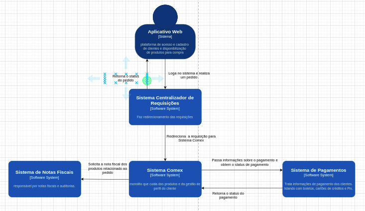
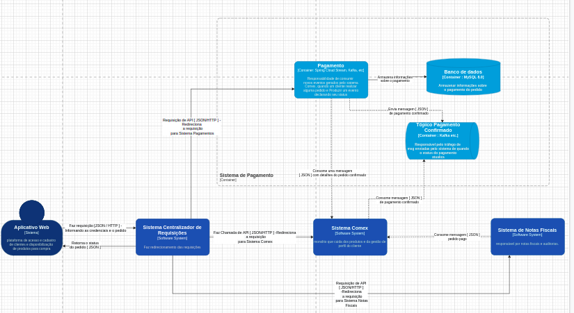
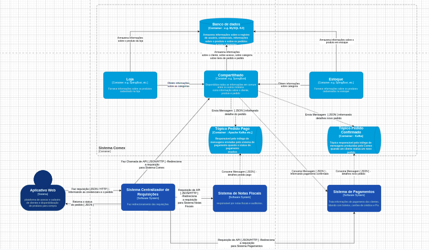
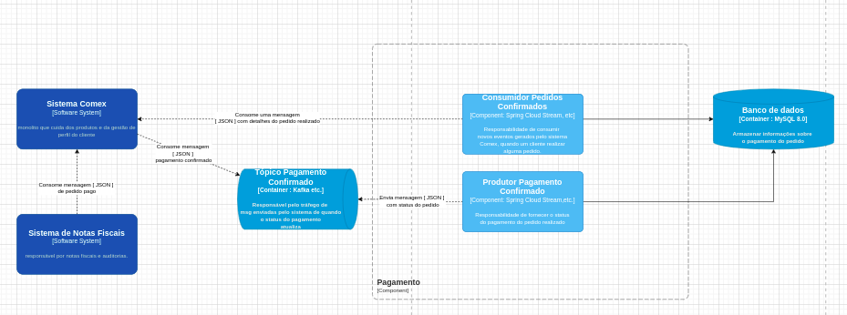
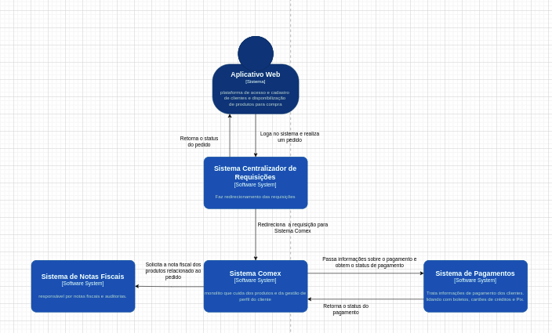
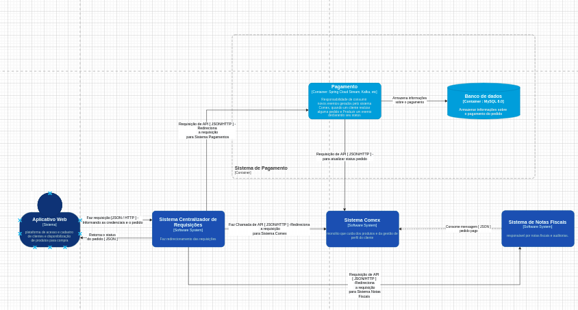
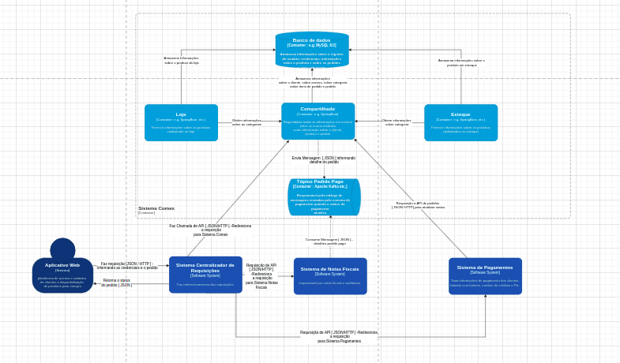
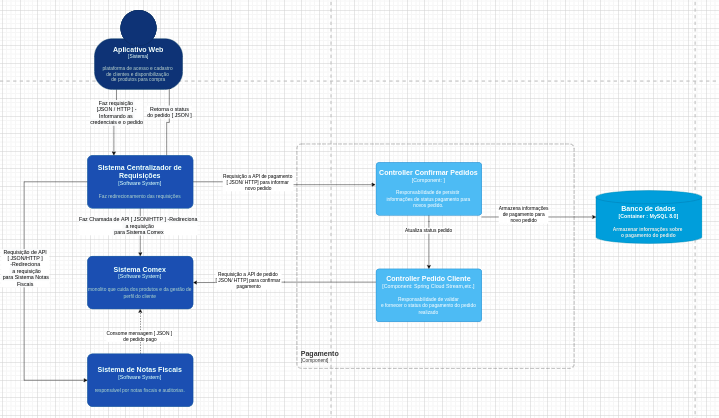
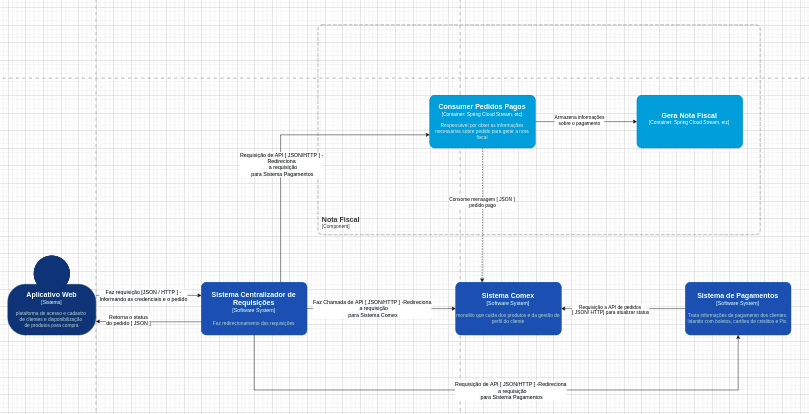

# Comex

<h2>Warning!</h2>

É necessário mudar a propriedade server.port do aplication properties

ou rodar o servidor discovery e o api-gateway para acessar os microsserviços

<h4>Servidor Discovery: </h4><link>https://github.com/darasms/discovery-server</link>
<h4>API-Gateway: </h4><link>https://github.com/darasms/api-gateway-alura</link>

<h2>Primeira Versão da Arquitetura</h2>

<h4>C4 - Context</h4>

<h4>C4 - Container (Pagamento)</h4>

<h4>C4 - Container (Comex)</h4>

<h4>C4 - Componente (Pagamento)</h4>

<h2>Arquitetura Final </h2>

<h4>C4 - Context</h4>

<h4>C4 - Container (Pagamento)</h4>

<h4>C4 - Container (Comex)</h4>

<h4>C4 - Componente (Pagamento)</h4>

<h4>C4 - Componente (Nota Fiscal)</h4>

